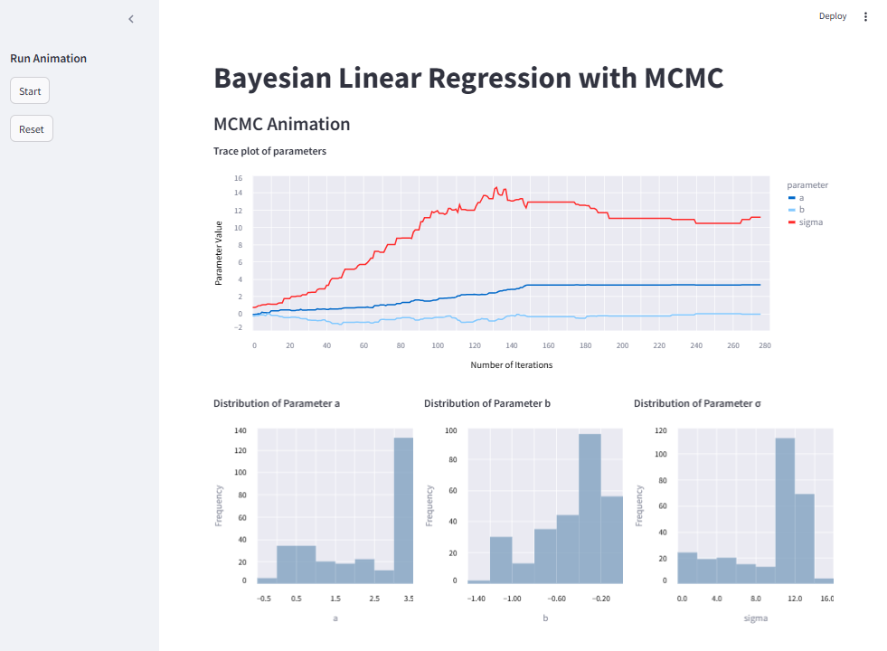

# Markov Chain Monte Carlo Simulator App



## Background:
I was inspired by this excellent [Medium article by Fortunato Nucera](https://medium.com/@tinonucera/bayesian-linear-regression-from-scratch-a-metropolis-hastings-implementation-63526857f191
) on the subject of using Metropolis Hastings for Bayesian Regression and set about trying to implement a variation of this myself. Additionally, I thought it would make for an interesting challenge to animate the results in streamlit!

In this project I wanted to:
* implement the Metropolis Hastings algorithm for a Simple Linear Regression model.
* create a streamlit app
* test and deploy this application.

**TODOS:**
* ✨Style✨ the main page.
* Make parameters such as the number of burn in samples configurable in the side bar.
* Extend this to Bayesian Multiple Linear Regression.
* Deploy this on a Kubernetes instance (e.g. Minikube)

## Installation:
```bash
# Setup for development
pip install pipenv
pipenv install --dev

# To run in virtualenv
pipenv shell 
```

## Usage:

```bash
streamlit run main.py
```

If you want to generate new data, run the following command:
```bash
python scripts/generate_data.py
```
